# YtUINavigation


## setup

Make your GameInstance class inherit from the class  `UYtUIGameInstance`


in GameInstance Blueprint class, config all menu widget blueprint

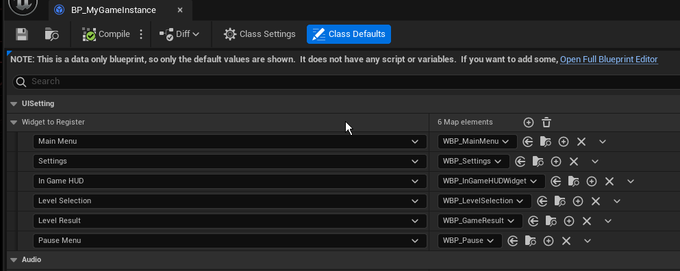


in level `HUD`,  call `Register Widgets`


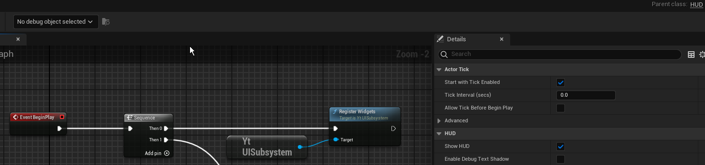

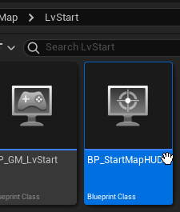


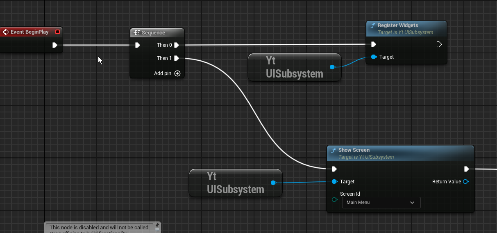

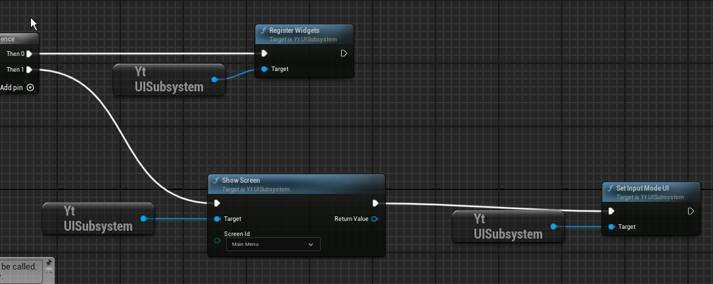


## use ui navigation

```c++

UFUNCTION(BlueprintCallable)
UUserWidget* ShowScreen(EUIScreen ScreenId); // Replace current (clear stack), like HUD

UFUNCTION(BlueprintCallable)
UUserWidget* PushScreen(EUIScreen ScreenId); // Push onto stack

UFUNCTION(BlueprintCallable)
void PopScreen(); // Pop top and show previous

```


## use global style


You can apply a consistent UI style throughout the entire project.


create DataAsset

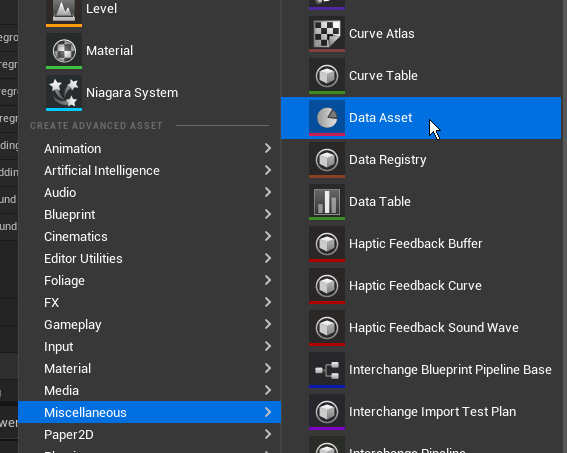


select `UIStyle Data`

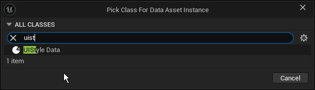

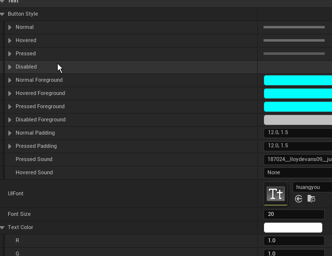


Set the parent class of the Widget Blueprint to `UYtBaseWidget` .


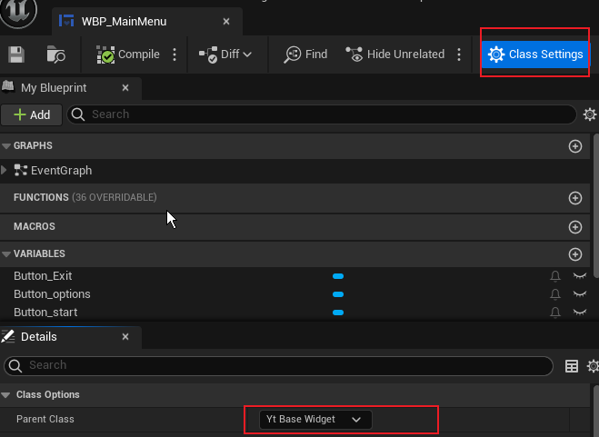

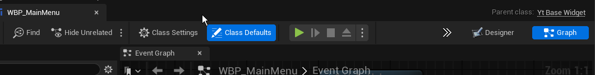


set `Designer Style Data`；


If the current widget does not want to use the global style, uncheck **Use Designer Style**. Otherwise, the “GlobalUIStyle” will override the current widget.


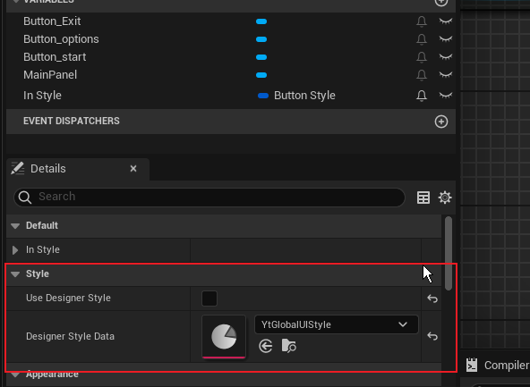


